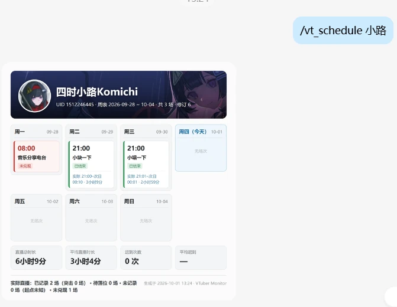
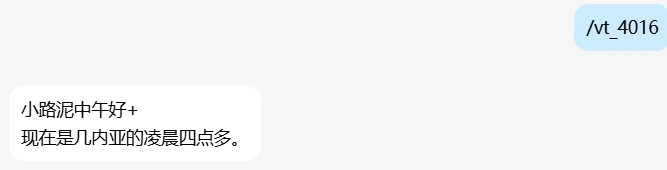

# astrbot_plugin_vtuber_monitor

为 [AstrBot](https://github.com/AstrBotDevs/AstrBot) 设计的 Bilibili VTuber 直播与周表追踪插件：订阅主播后自动推送上下播、解析并维护周表，必要时根据动态自动调播。

## ✨ 功能特性

- **直播上下播通知**：特别关注默认只推上播，普通关注可单独开关；通知带直播标题、封面和直播间链接。
- **周表图片**：`/vt_schedule` 把本周周表渲染成一张日历图——顶部是空间头图加头像的横幅与主播原名，主体是两行四列的七天网格，底部是总时长／平均时长／迟到次数／平均迟到。全部在本机渲染，不依赖第三方文转图服务。
- **周表自动解析与定时更新**：特别关注订阅后自动解析，之后每天在配置的时间点（默认 `00:30`、`12:30`、`20:30`）检查**当前置顶与最近几条动态**，发现新周表图或改过的图就更新。
- **动态自动调播**：主播发动态说改期、取消或加播时，自动识别并修改本周周表，改完可推送结果。
- **未兑现标记**：排期到点 2 小时仍未开播、且没有被动态调播的场次在图上标红并计入统计；当天之内又开播会自动撤销标记。
- **置顶动态合并转发**：`/vt_pinned` 在 OneBot 上以合并转发形式发送动态完整截图与被识别为周表的图片。
- **凌晨四点问候**：`/vt_4016` 随机挑一个正处于凌晨四点的国家和地区，交给模型造句发送。

### 界面预览

<a href="docs/vt_schedule.webp"></a>

在聊天里收到 `/vt_schedule` 的样子：一周拆成上下两行、每列一天，今天所在列高亮，未兑现的场次标红，底部是本周时长与迟到统计，顶部横幅取自主播真实的 B 站空间资料。

| 上播通知 | 凌晨四点问候 |
| :---: | :---: |
|  |  |
| 带直播间封面、标题与链接 | `/vt_4016` 随机挑一个正处于凌晨四点的国家 |

## 🚀 安装

- 在 AstrBot 插件市场搜索 `astrbot_plugin_vtuber_monitor`；
- 或使用指令安装：

```shell
plugin i https://github.com/saximoerjh/astrbot_plugin_vtuber_monitor
```

周表图片与置顶截图依赖 `playwright`：Python 包会随插件依赖自动装好，但**浏览器本体不会自动下载**。

> **Linux / macOS 用户在插件安装后必须再跑一次：**

```shell
python -m playwright install chromium
```

- **Windows**：`screenshot_browser_channel=auto` 在缺少 Chromium 时退回系统 Edge，通常开箱可用。
- **Linux / macOS**：一般没有 Edge，`auto` 固定走 Chromium，不装浏览器就渲染不出周表图与截图。
- **手动指定**：把「截图浏览器」设为 `chromium`、`msedge` 或 `chrome`。

## ⚙️ 配置

**必须先选「多模态识别模型」**，否则只能缓存周表图片、无法解析周表与自动调播。该模型同时用于周表识别、调播判断和凌晨问候，需要支持图片输入（调播判断还要求工具调用能力）。留空时周表不解析、不调播，问候改用固定句式。

登录 Bilibili 只有一种方式：**管理员私聊执行 `/bili_login` 扫码**，凭据由插件接口返回并保存在 `plugin_data`。没有可手动填写的凭据配置项，也不需要自己抓 Cookie。不登录也能用，只是部分接口受 Bilibili 风控限制。

常用配置项：

| 配置项 | 默认 | 说明 |
| :--- | :--- | :--- |
| 监听特别关注 | 开 | 特别关注的采集开关。关掉后不再记录实际直播，落位、未兑现与时长统计一并停止 |
| 有周表时自动调播 | 开 | 主播发动态宣布改期／取消／加播时自动修改本周周表 |
| 特别关注上播通知 / 下播通知 | 开 / 关 | 特别关注的通知开关，彼此独立，不受普通关注开关影响 |
| 普通关注上播通知 / 下播通知 | 开 / 开 | 需要先开「同时监听普通关注」 |
| 周表扫描时间 | 00:30、12:30、20:30 | 每天检查新周表的时间点；留空即关闭定时扫描 |
| 普通关注自动解析周表 | 关 | 打开后普通关注也会自动解析并进入定时检查 |
| 周表以图片回复 | 开 | 关闭后 `/vt_schedule` 返回文字版 |
| 未兑现判定（小时） | 2 | 排期后超过该时长仍未开播即标记未兑现 |
| 截图浏览器 | auto | 周表图片与置顶截图共用的浏览器通道 |

> 配置修改后需要重载插件。

## 📖 使用说明

### 指令一览

| 指令 | 参数 | 说明 | 权限 |
| :--- | :--- | :--- | :--- |
| **vt_sub** | `<UID> [normal\|special]` | 订阅主播，默认普通关注 | 所有人 |
| **vt_unsub** | `<UID或别名>` | 取消当前会话的订阅 | 所有人 |
| **vt_list** | (无) | 列出当前会话的订阅 | 所有人 |
| **vt_follow_level** | `<UID或别名> <normal\|special>` | 修改已有订阅的关注级别 | 所有人 |
| **vt_alias** | `<UID或旧别名> <新别名>` | 添加个人别名，可重复添加多个 | 所有人 |
| **vt_alias_del** | `<别名>` 或 `<UID> <别名>` | 删除个人别名，不取消订阅 | 所有人 |
| **vt_schedule** | `[UID或别名] [本周\|上周\|下周\|YYYY-MM-DD]` | 查看周表，省略参数即查本周 | 所有人 |
| **vt_schedule_history** | `<UID或别名>` | 列出已缓存的周次 | 所有人 |
| **vt_revisions** | `<UID或别名>` | 查看最近十次周表修订 | 所有人 |
| **vt_live** | `<UID或别名>` | 查询直播状态，不触发通知 | 所有人 |
| **vt_latest** | `<UID或别名>` | 查询最新动态的卡片截图，不修改检查点 | 所有人 |
| **vt_pinned** | `<UID或别名>` | 合并转发置顶动态截图与周表图 | 所有人 |
| **vt_4016** | (无) | 看看现在哪个国家是凌晨四点 | 所有人 |
| **vt_status** | (无) | 查看监听状态与计数 | 所有人 |
| **vt_ping** | (无) | 检查插件是否已加载 | 所有人 |
| **bili_login**（别名 `vt_login`） | (无) | 私聊扫码登录 Bilibili | 管理员 |
| **vt_parse_schedule** | `<UID或别名> [本周\|上周\|下周\|YYYY-MM-DD]` | 手动解析周表，并建立定时检查基准 | 管理员 |
| **vt_adjust_test** | `<UID或别名> <动态正文>` | 调播预演，不保存、不推送 | 管理员 |
| **vt_retry_adjust** | `<UID或别名> <动态ID>` | 重试一条失败的调播 | 管理员 |

### 关注级别与别名

`special` 是**特别关注**：默认自动监听上下播、自动解析周表，并接收周表更新／调播通知。`normal` 是普通关注：默认**不被轮询**（需要打开「同时监听普通关注」才会推送上下播），周表要手动 `/vt_parse_schedule` 一次才会进入定时检查，除非打开「普通关注自动解析周表」。

别名按「会话 + 用户」隔离，只影响你自己的书写习惯，不影响会话订阅。设置后所有接受 UID 的指令都能用别名：

```text
/vt_alias 1512246445 小路
/vt_sub 1512246445 special
/vt_schedule 小路
/vt_pinned 小路
```

### 周表是怎么来的

订阅特别关注后会立即扫描一次，找到本周周表就保存并进入定时检查。之后每个扫描时间点都会检查**当前置顶动态 + 最近几条候选动态**：换成正周表、编辑置顶换图、把周表发成新动态都能被发现；同一张图按内容指纹去重，稳态下不会重复调用模型。启动时会补查最近一个已过的时间点一次。

周表也支持手动维护：`/vt_parse_schedule` 扫描候选图片并解析，成功后同样建立定时检查基准。已经解析过的来源动态在配置的扫描时间点由定时任务自动复查。

### 通知怎么发

上下播通知在**状态跳变时**发送一次：开播推「开播了」并附标题、封面与直播间链接，下播推「下播了」。改标题或换封面不会重复触发。

周表更新通知与调播结果通知走动态轮询投递，默认关闭，可在「通知内容」里打开。**调播通知分两条发送**：先发触发这次调播的**动态截图**，再发精简结果（每场一行改动 + 一句依据）；截图失败只发文字。多个会话复用同一张截图。

## ❓ 常见问题

1. **周表图片在手机上偏小？**  
   版式按"字号占图片宽度约 2%"设计（840px 宽、两行四列、二倍像素密度），这是在不点开的情况下也能看清的取舍；再小就需要改 `services/schedule_renderer.py` 里的版式常量。

2. **周表图片没有头图或头像？**  
   该主播可能没设置空间头图，或抓取失败。素材按 7 天 TTL 刷新，当天失败不会重试；从来没成功获取过时会退回纯文字标题行。原因记录在 `plugin_data/astrbot_plugin_vtuber_monitor/profiles/<UID>/profile.json` 的 `errors` 字段。

3. **周表没有自动更新？**  
   检查「周表扫描时间」是否为空；普通关注需要手动 `/vt_parse_schedule` 过、或打开「普通关注自动解析周表」；没有配置多模态识别模型时只能缓存图片。「一周」按北京时间周一至周日，同一周内的第二个及后续版本会交给模型判断是同周修订还是下一周。

4. **直播没有被记录，或者一直显示"直播中"？**  
   实际直播依赖直播轮询，且特别关注需要「监听特别关注」开启。历史遗留的重复条目可以对那一周重新执行 `/vt_parse_schedule` 让它收敛成一条。

5. **接口报 `-352` / `412`，或提示登录失效？**  
   属于 Bilibili 风控。先确认凭据有效（重新 `/bili_login`），并适当调大「基础间隔」减少请求频率；风控冷却期间插件会自动退避。

6. **扫码登录失败？**  
   `/bili_login` 只能由管理员在私聊中触发，二维码有效期约 3 分钟。登录成功后凭据保存在 `plugin_data`，失效时重新扫码即可，本插件不做自动刷新；已有凭据只有在扫码成功后才被替换，失败时保留旧的。

## 🧪 开发与测试

```shell
# 单元测试（使用 uv 隔离环境，不修改 AstrBot 依赖）
uv run --with pytest --with pytest-asyncio --with httpx --with tzdata --with 'qrcode[pil]' python -m pytest tests -q

# 用 AstrBot 自带的 Python 跑真实框架生命周期冒烟
python tests/runtime_smoke.py

# 渲染一张样例周表，检查版式（--live <UID> 会用真实主播抓头像与头图）
python tests/render_preview.py --live 1512246445
```

运行期数据都在 `plugin_data/astrbot_plugin_vtuber_monitor/`：`monitor.sqlite3`（订阅、周表、实际直播）、`schedule_images/`（周表原图）、`notice_images/`（调播通知附带的动态截图）、`profiles/`（头像与头图）、`schedule_render/`（周表图片缓存）、`login_qr/`。缓存目录都有上限或按内容哈希去重。

## 📄 许可

[AGPL-3.0](LICENSE)
